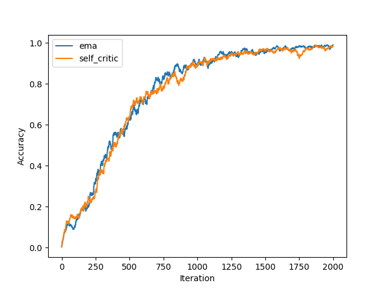

# RNN Decoding Steps Embedding

Reinforcement learning for a toy task of RNN decoding steps embedding.

## Task Description

**Input**: an integer L.  
**Output**: a sequence of vectors with length L.

## Network Design

```
For each decoding time step t:
    a_t ~ Bernoulli(F_t(L; θ))
    if a_t == 0 then
        halt
```

## Training Objective

$$ \theta = \arg\max\limits_\theta \mathbb{E}_{a_1^{L'}}[\mathcal{R}\log p(a_1^{L'}|L)] $$

Where $\mathcal{R}$ is the reward, which is determined by $L$ and $L'$. Here $\mathcal{R} = |L'- L|$ is selected.

## Run code

### Dependencies

- pytorch
- tqdm

### Run

```
python3 main.py
```

### Results 

 
